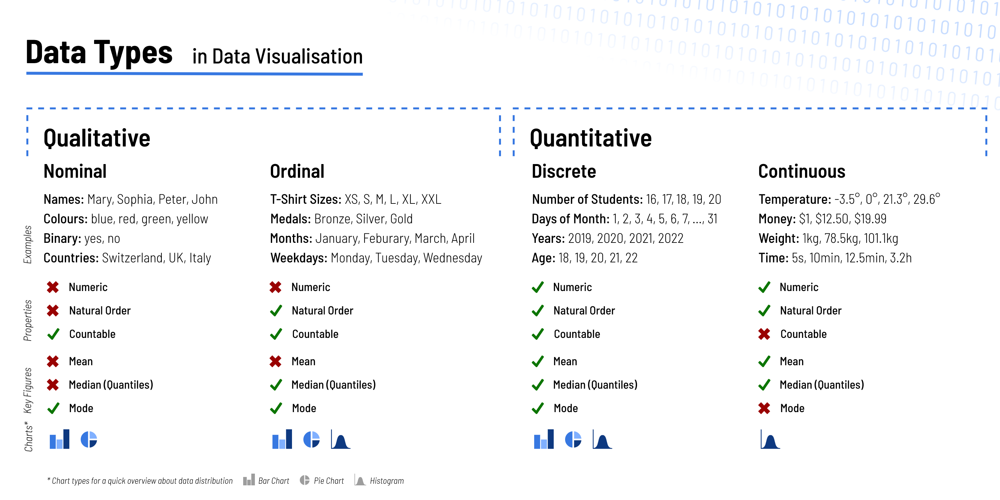

```{r setup, include=FALSE}
knitr::opts_chunk$set(echo = FALSE)

original_plot <- knitr::knit_hooks$get("plot") 
knitr::knit_hooks$set(plot = function(x, options) {
  graphic <- original_plot(x, options)
  if(!is.null(options$wrapfigure)) {
    graphic <- str_replace(graphic, fixed("\\begin{figure}"), "")
    graphic <- str_replace(graphic, fixed("\\end{figure}"), "")
    begin <- sprintf('\\begin{wrapfigure}{%s}{%g\\textwidth}', options$wrapfigure[[1]], options$wrapfigure[[2]])
    return (c(begin, graphic, '\\end{wrapfigure}'))
  }
  return(graphic)
})


library(tidyverse)
library(zoo)
library(ggplot2)
library(RSwissMaps)
library(corrr)
source('./data.R')

raw_data <- load_data()
long_data <- raw_data %>%
  rename_with(~ gsub('^(.{2})\\.(.+)$', '\\1.kanton.\\2', .x), zh.berecht:ju.annahme) %>%
  pivot_longer(zh.kanton.berecht:ju.kanton.annahme, names_to = c('kanton', '.value'), names_pattern = "(.{2})\\.(.+)", values_drop_na = TRUE)

total_entries <- nrow(raw_data)
```

\vspace{10pt}

\begin{center}
Github Repository: https://github.com/josefweibel/ds-gdv-report
\end{center}

\newpage

# Design Principles vs. Data

It is not just about the graphical presentation of data visualisations. Before chart type and characteristics can be chosen, the required data must be sourced and processed to suit the desired graphic. These process steps can occupy much time and often take longer than actually plotting the charts. 

## Data Sources

Data sources vary enormously depending on the required data. In many cases, data from multiple origins are needed to answer a specific question, especially when a causal variable to a given variable is sought. 

Depending on the data source, some data formats and structures are more common than others. Sensors provide their data generally in a simple list with an entry per measurement along with the time of measurement. On the other hand, data is often retrieved from relational databases, storing data in different tables that must be joined to retrieve the combined records. However, Open Data comes often in the form of preprocessed denormalised CSV files containing the data from different entities, containing redundant data because of the denormalisation. Finally, data is often still be provided in the form of manually assembled spreadsheets. These are prone to human errors and often contain summary rows that have to be removed [@http://zotero.org/users/7645537/items/FE295SK9] to analyse the data using automated tools like `dplyr` or `pandas`. These tools can then be used to execute the so-called Data Wrangling, meaning transforming data, to use it for visualisation or other actions eventually. 

## Data Cleansing

No matter whether training a model or visualising it, every data intended to be processed should first undergo the process of data cleansing. This procedure helps prevent getting wrong insights and, in turn, taking bad decisions from them - or as Elgabry states, "Garbage in, garbage out."  [-@http://zotero.org/users/7645537/items/XGT97YUG]

```{r outliers_boxplot, warning = FALSE, fig.asp=1.2, out.width=".15\\textwidth", wrapfigure=list("R", 0.15), fig.cap=outliers_boxplot_caption}
outliers_boxplot_caption <- 'Box plot visualising outliers.'
plot_outliers_boxplot <- function () {
  ggplot(raw_data, mapping = aes(y = volkja.proz)) +
    geom_boxplot(coef = 1, outlier.size = 3) +
    labs(
      title = 'Outliers in Yes Votes Percentage',
      y = 'Yes Votes Percentage'
    )
}

plot_outliers_boxplot()
```

Five criteria must be fulfilled to ensure data quality. One of those criteria is **validity** that can be confirmed by checking the received data for defined business rules or constraints. For instance, a particular variable may contain only values of a defined set, or the contents of some variables must match a specific pattern like a phone number or zip code [@http://zotero.org/users/7645537/items/XGT97YUG]. On the other hand, the **accuracy** of the dataset must be ensured. Certain values could be incorrect, and for outliers, this is sometimes the case. Thus, checking their correctness and dropping them in the case of incorrectness is a must. Box plots can be helpful in this task since they visualise any outliers. The plot on the right shows some referendums with very low or very high acceptance rates (points above and below the whiskers), which should be inspected for correctness. For manually assembled data, errors often occur due to typing errors. However, values other than outliers could be erroneous, but finding such values, especially in a vast dataset, is very difficult and should be automated. 

The following criterion **consistency** is somewhat similar to the two previously mentioned. The dataset must be consistent in itself, meaning that no values contradict each other. For example, in a dataset of flat tenants, a move-in date must always be before the same tenancy agreement's move-out date. However, this requires a good business understanding. Not that much of it is required for checking the **uniformity** of the data. All values of a variable should be of the same unit [@http://zotero.org/users/7645537/items/XGT97YUG] or if not practical (e.g. money), the unit should be known and stored along with the value. 

Lastly, data scientists should check for **completeness**. Depending on the variable and the context, missing values can be desired but should be denoted the same way for all entries. Programming languages provide specific placeholders for missings, often called `NA`, `null` or `undefined`. In cases where missings can not be handled, for example, when the values are essential to answer the question, either the whole row containing the missing must be dropped, or a suitable value must be generated somehow. Dropping rows should be avoided since valuable information will be disregarded, and especially the rows containing missings can hold interesting peculiarities. When trying to generate values for missings, the best case would be determining the missing values by consulting the source or consulting another source. However, this is often not feasible, and data scientists can attempt to generate possible values by using the other rows in the dataset. Similar rows containing a value in the missing's variable could be determined, and the value can be generated by computing the median or mean of the values of these rows. 

### Data Types

One crucial step in data cleansing is identifying the correct data type for each variable and declaring it in the programming language. Knowing the data type is vital to use the correct chart types for visualisation. As already mentioned in part 1, not every chart type is suitable for every type of data. Furthermore, not every statistical key figure (e.g. mean, median) can be calculated for every type. 

```{r, include = FALSE}
data_types_infographic_caption <- 'Infographic showcasing different data types and their properties.'
```

{width=90%}

One of the first analysis a data scientists makes is checking the distribution of a variable. For that, various chart types are available, but not all of them are suitable. Since qualitative data is categorised, a simple bar plot can be used to get an impression of the distribution. Every value is plotted as a bar or column, and its length reflects the number of occurrences. Since a continuous quantitative variable could have hundreds of different values, a bar chart would be too convoluted. Thus, a histogram is more practicable since it creates groups, the so-called bins, from the existing values. Another possibility is density plots; however, both have their advantages and disadvantages, as explained in the first part. 

The following plots demonstrate plotting the data distribution of a continuous quantitative variable. A bar chart has been used on the left side, and the right side, a histogram with bin width `1` per cent. Since percentage values occurring more than once are very unlikely even in this dataset with more than 600 referendums, the bar chart shows hundreds of columns indicating only one or, at maximum, three occurrences. On the histogram, though, the accurate data distribution is apparent at first glance. 

```{r distribution_quantitative, warning = FALSE, fig.asp=0.3, out.width="50%", fig.show = "hold", fig.cap=distribution_quantitative_caption}
distribution_quantitative_caption <- 'Histogram and bar chart showing data distribution of quantitative variable.'
plot_volkja_barchart <- function () {
  ggplot(raw_data, mapping = aes(x = volkja.proz)) +
    geom_bar() +
    labs(
      title = 'Distribution of Yes Votes Percentage',
      y = 'Number of Referendums',
      x = 'Yes Votes Percentage'
    )
}
plot_volkja_histogram <- function () {
  ggplot(raw_data, mapping = aes(x = volkja.proz)) +
    geom_histogram(binwidth = 1) +
    labs(
      title = 'Distribution of Yes Votes Percentage',
      y = 'Number of Referendums',
      x = 'Yes Votes Percentage'
    )
}

plot_volkja_barchart()
plot_volkja_histogram()
```

```{r distribution_qualitative, warning = FALSE, fig.asp=0.4, out.width=".3\\textwidth", wrapfigure=list("R", 0.3), fig.cap=distribution_qualitative_caption}
distribution_qualitative_caption <- 'Bar chart showing data distribution of qualitative variable.'

data_with_annahme <- raw_data %>% 
  filter(!is.na(annahme))

plot_annahme_barchart <- function () {
  ggplot(data_with_annahme, mapping = aes(x = annahme)) +
    geom_bar() +
    labs(
      title = 'Distribution of Final Results',
      y = 'Number of Referendums',
      x = 'Final Results'
    )
}

plot_annahme_barchart()
```

The bar chart on the right visualises the number of accepted and rejected referendums. Since the variable is nominal qualitative and even binary, a bar chart is appropriate to accomplish this task. A histogram would roughly be the same as this plot since histograms' primary function, creating suitable bins, is neglected as the groups are already defined. Pie charts can be used as an alternative to box plots; however, they should only be used when showing parts of a whole, the number of parts is lucid, and all parts are big enough to be recognised in the plot. 

\newpage

# Appendix

## Figures

### Figure 1: `r outliers_boxplot_caption`

```{r appendix-figure-outliers-boxplot, warning = FALSE}
plot_outliers_boxplot()
```

### Figure 2: `r data_types_infographic_caption`



### Figure 3: `r distribution_quantitative_caption`

```{r appendix-distribution-quantitative, warning = FALSE, out.width="50%", fig.show = "hold"}
plot_volkja_barchart()
plot_volkja_histogram()
```

### Figure 4: `r distribution_qualitative_caption`

```{r appendix-distribution-qualitative}
plot_annahme_barchart()
```


\newpage

# References

