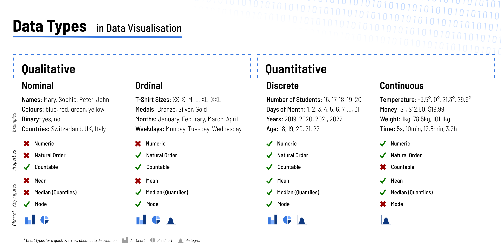

---
output:
  pdf_document:
    keep_tex: yes
    md_extensions: +raw_attribute
    toc_depth: 2
bibliography: bibliography.json
csl: apa.csl
geometry: left=1.5cm,right=1.5cm,top=1.9cm,bottom=1.9cm
header-includes:
- \usepackage{graphicx}
- \usepackage{wrapfig}
- \usepackage{caption}
- \captionsetup[figure]{font=tiny}
- \usepackage{fancyhdr}
- \pagestyle{fancy}
- \fancyfoot[L]{Joseph Weibel}
- \fancyfoot[R]{Fundamentals of Data Visualization}
---

```{r setup, include=FALSE}
knitr::opts_chunk$set(echo = FALSE)

original_plot <- knitr::knit_hooks$get("plot") 
knitr::knit_hooks$set(plot = function(x, options) {
  graphic <- original_plot(x, options)
  if(!is.null(options$wrapfigure)) {
    graphic <- str_replace(graphic, fixed("\\begin{figure}"), "")
    graphic <- str_replace(graphic, fixed("\\end{figure}"), "")
    begin <- sprintf('\\begin{wrapfigure}{%s}{%g\\textwidth}', options$wrapfigure[[1]], options$wrapfigure[[2]])
    return (c(begin, graphic, '\\end{wrapfigure}'))
  }
  return(graphic)
})


library(tidyverse)
library(zoo)
library(ggplot2)
library(RSwissMaps)
library(corrr)
source('./data.R')

raw_data <- load_data()
long_data <- raw_data %>%
  rename_with(~ gsub('^(.{2})\\.(.+)$', '\\1.kanton.\\2', .x), zh.berecht:ju.annahme) %>%
  pivot_longer(zh.kanton.berecht:ju.kanton.annahme, names_to = c('kanton', '.value'), names_pattern = "(.{2})\\.(.+)", values_drop_na = TRUE)

total_entries <- nrow(raw_data)
```

\begin{titlepage}
    \begin{center}
        \vspace*{1.5cm}

        \Huge
        \textbf{Fundamentals of Data Visualization}

        \vspace{0.5cm}
        \LARGE
        Report

        \vspace{1.5cm}

        \textbf{Joseph Weibel}

        \vfill

        \Large
        FHNW\\
        Data Science\\
        June 2021
        
        \vspace{1.5cm}
        
        \normalsize
        Github Repository: https://github.com/josefweibel/ds-gdv-report

    \end{center}
\end{titlepage}

\setcounter{tocdepth}{2}
\tableofcontents

\newpage

Analysing large amounts of data in a simple table is hard, even for experienced data scientists. Determining data characteristics like distribution, dispersion, and extreme values from a data table requires a lot of brainpower and are not practical for laypersons. An excellent way is to visualise the data using plots which help the viewer to focus on specific data characteristics and see the essential aspects at first glance. It is easy to create visualisations; however, creating sophisticated visualisations requires a good understanding of the possibilities and pitfalls. Otherwise, visualisations can be misleading and, therefore, worse than no visualisation at all. In the following pages, important visualisation characteristics will be discussed along with some examples based on the Swissvotes dataset, which contains voting results about all Swiss popular votes since the first one in 1848 [@http://zotero.org/users/7645537/items/X2S7ZYLM]. 

# Visualisation Basics, Chart Types

Before a data visualisation can be created, the correct chart type must be chosen, depending on the data types in the dataset and the aspects to highlight in the plot. Every chart type works only for specific data type combinations and can show only a certain amount of variables of each type [@http://zotero.org/users/7645537/items/USSJK9H4]. Data can be separated into two main types. On the one hand, there is numerical data which is everything that is represented as a number. Numerical data, in turn, can be separated into continuous (e.g. temperature, weight) and discrete (e.g. days in a month, number of students in a class) data. On the other hand, there is categorical data which is anything not numerical. Data of this type is differentiated between ordinal and nominal data, whereby the first is data that has a natural order, and the latter does not. Besides the data structure, the correct chart type depends on the target the creator wants to fulfil with the chart. There are chart types dedicated to comparing values, showing relationships between variables, and revealing the data structure. After defining the target and the variables to present, a suitable chart type can be evaluated. 

```{r histogram, out.width=".25\\textwidth", wrapfigure=list("R", 0.25), fig.cap=histogram_caption}
histogram_caption <- 'Histogram showing number of referendums per year.'
plot_histogram <- function () {
  binwidth <- 1
  ggplot(raw_data, mapping = aes(x = jahr)) +
    geom_histogram(binwidth = binwidth) +
    labs(
      title = 'Number of Referendums per Year',
      subtitle = sprintf('Total: %d, Bin Width: %d', total_entries, binwidth),
      x = 'Year',
      y = 'Quantity'
    )
}

plot_histogram()
```

## Histogram

One of the first handy plots to familiarise with a new dataset is the histogram. It reveals the distribution of a variable's values whereby the x-axis usually shows the ordinal data and the y axis reflects the number of occurrences. Since histograms group values of the variable in so-called bins, these plots can hide important information when the bin size is chosen inappropriately. They can hide the real distribution when the bins are too large, and the plot can get too unclear when set too small. The histogram on the right shows the number of referendums held per year since 1848. It is clearly visible that, generally speaking, more votes have been held yearly in the last 50 years than in the years before and that only a few were held in the early days of the federal state. Such conclusions are a major goal of a histogram.

```{r densityplot, fig.asp=.6, out.width=".25\\textwidth", wrapfigure=list("R", 0.25), fig.cap=densityplot_caption}
densityplot_caption <- 'Density plot showing distribution of referendums per year.'
plot_densityplot <- function () {
  ggplot(raw_data, mapping = aes(x = jahr)) +
    geom_density() +
    labs(
      title = 'Referendums per Year',
      x = 'Year',
      y = 'Relative Quantity'
    )
}

plot_densityplot()
```

## Density Plot

A similar chart type to the histogram is the density plot, which shows the distribution using a curve indicating the value's relative frequency instead of the actual count. The curve is smoothed, and hence this plot is easier to understand than the histogram. However, this leads to some inaccuracy, and therefore the visualised data should be continuous and have a smooth distribution to avoid getting too inaccurate graphics. It is a similar problem as with the too-large bin sizes on histograms. The inaccuracy can be observed when comparing the density plot in figure 2 with the histogram above.

```{r boxplot, fig.asp=1.39, out.width=".1\\textwidth", wrapfigure=list("R", 0.17), fig.cap=boxplot_caption}
boxplot_caption <- 'Box plot showing distribution of voting results.'
plot_boxplot <- function () {
  ggplot(raw_data, mapping = aes(y = volkja.proz)) +
    geom_boxplot() +
    labs(
      title = 'Distribution Voting Results',
      y = 'Percentage Yes Votes'
    )
}

plot_boxplot()
```

## Box Plot

Another way to show the distribution of a numeric or ordinal variable, but more focussed on key metrics than the actual distribution, is the box plot. The rendered box represents the middle 50% of the occurrences, and the lines and possibly points outside the box represent the remaining entries. Also, the median value is marked with a line inside the box. This chart is very technical and should not be presented to the general public without a proper introduction. Nevertheless, it is helpful to show these metrics graphically, primarily when multiple box plots for several categories are generated and placed side by side to compare them with each other. The example boxplot shows a median slightly below 50%, meaning more referendums were rejected than accepted.

\newpage


```{r scatterplot, out.width=".25\\textwidth", wrapfigure=list("R", 0.25), fig.cap=scatterplot_caption}
scatterplot_caption <- 'Scatter plot showing number of cantons accepting a referndum along with the yes votes percentage.'
plot_scatterplot <- function () {
  data <- long_data %>%
    group_by(anr) %>%
    summarise(
      annehmende_kantone = sum(ifelse(kanton.annahme == 'Accepted', 1, 0)), 
      volkja.proz = first(volkja.proz),
      annahme = first(annahme),
      .groups = 'drop'
    ) %>%
    ungroup()
  correlation <- cor(data$volkja.proz, data$annehmende_kantone, method = 'pearson')
  ggplot(data, mapping = aes(x = volkja.proz, y = annehmende_kantone, color = annahme)) +
    geom_point() +
    scale_colour_manual(values = c('darkblue', 'darkred')) +
    labs(
      title = 'Factors for votes\' final result',
      subtitle = sprintf('Pearson Correlation: %f', correlation),
      y = 'Number of Accepting Cantons',
      x = 'Overall Yes Votes Percentage',
      color = 'Final Result'
    )
}

plot_scatterplot()
```


## Scatter Plot

A chart supporting two variables is the scatter plot. Every record in the dataset is shown as a point on a cartesian plan aligned on its values of both variables, placed on the x and y axes. It is especially useful to inspect a possible correlation between the two variables, being the case in the example. The more cantons accept a referendum, the bigger the part of the population accepting the referendum. It is even possible to integrate more variables into a scatter plot using different colours and transparency for the points. The example shows the votes' final results, and obviously, all referendums with less than 50% yes ballots got rejected. However, not all referendums above this limit were accepted since certain also require a majority of accepting cantons. With outliers or many data points, the points can overlap, and thus the plot can lead to misinterpretation. In these situations, it is good advice to jitter the points or focus on cluttered parts of the dataset.

```{r linechart, fig.asp=0.4, out.width=".25\\textwidth", wrapfigure=list("R", 0.25), fig.cap=linechart_caption}
linechart_caption <- 'Line chart showing voter participation over time.'
plot_linechart <- function () {
  rolling_period = 5
  data <- as_tibble(raw_data %>%
    filter(!is.na(bet)) %>%
    group_by(jahr) %>%
    summarise(avg_bet = mean(bet), .groups = 'drop') %>%
    ungroup() %>%
    rollapply(rolling_period, mean, align = 'right'))
  ggplot(data, mapping = aes(x = jahr, y = avg_bet)) +
    geom_line() +
    xlim(1879, 2020) +
    ylim(0, 100) +
    labs(
      title = 'Voter Participation over Time',
      subtitle = sprintf('Rolling period over last %d years', rolling_period),
      y = 'Participation in Percent',
      x = 'Voting Date'
    )
}

plot_linechart()
```

## Line Chart

Line charts work the same way as scatter plots except that a line is drawn between the points. Thus it also requires a continuous variable on the x-axis (or y-axis if mirrored) and only one value per x-axis unit. Time-based data like stock prices or voter participation (see example) over time is often shown on such plots. It is possible to visualise multiple lines on one plot, but the more lines are added, the worse the readability of the chart. 


```{r barchart, out.width=".25\\textwidth", wrapfigure=list("R", 0.25), fig.cap=barchart_caption}
barchart_caption <- 'Bar chart showing voter participation per canton.'
participation_per_canton_data <- long_data %>%
  filter(jahr >= 2000) %>%
  group_by(kanton) %>%
  summarise(avg_bet = mean(kanton.bet, na.rm = TRUE), .groups = 'drop') %>%
  ungroup() %>%
  arrange(desc(avg_bet)) %>%
  mutate(kanton = toupper(kanton))

plot_barchart <- function () {
  ggplot(participation_per_canton_data, mapping = aes(x = avg_bet, y = reorder(kanton, avg_bet))) +
    geom_bar(stat = 'identity', show.legend = FALSE) +
    labs(
      title = 'Average Voter Participation per Canton since 2000',
      y = 'Canton',
      x = 'Participation in Percent'
    )
}

plot_barchart()
```

## Bar Chart

Bar charts are straightforward for the viewer. Every value of a categorical variable has a bar or column that reflects the value of the corresponding numerical value. They are great to compare the numeric values, and if the numeric values are sums of different subordinated values, they can also be shown by dividing the bar into parts. These are called stacked bar charts. However, too many bars will make it difficult to determine an exact numeric value for the column, and the whole plot gets unwieldy. Restricting to only a certain amount of values will solve it [@http://zotero.org/users/7645537/items/PLQE7977]. The example shows the average voter participation since 2000 per canton. At first glance, the viewer can tell that participation is the highest in canton Schaffhausen, most likely because it is somehow compulsory to vote there.

```{r map, warning=F, fig.asp=0.45, out.width=".25\\textwidth", wrapfigure=list("R", 0.25), fig.cap=map_vaption}
map_vaption <- 'Map showing voter participation per canton.'
plot_map <- function () {
  participation_per_canton_map_data <- can.template(2016) %>%
    inner_join(participation_per_canton_data, by = c('name' = 'kanton'))
  can.plot(
    participation_per_canton_map_data$bfs_nr, 
    participation_per_canton_map_data$avg_bet, 
    2016,
    title = 'Average Voter Participation per Canton since 2000',
    legend_title = 'Participation in Percent',
  )
}

plot_map()
```

## Map

Geographical data, like the one in the last example, can indeed be shown on a map. Depending on the data points' accuracy, the data can be presented as exact points or as coloured areas (e.g. counties, countries) on the map. A significant advantage of plotting data on a map is that any geographical clusters and correlations are more apparent. Nonetheless, reading an exact value or finding slight differences between data points is not possible except they are printed on the map. However, this is more difficult for a static graphic with many points or small areas to highlight. 


## Pie Chart

```{r pie, fig.asp=0.3, out.width=".25\\textwidth", wrapfigure=list("R", 0.25), fig.cap=piechart_caption}
piechart_caption <- 'Pie chart showing result of a single vote.'
plot_piechart <- function (label_size = 6) {
  pie_data <- raw_data %>% 
    filter(anr == 395) %>%
    pivot_longer(c('leer', 'volkja', 'volknein'), names_to = 'typ', values_to = 'menge') %>%
    mutate(typ = factor(
      typ, 
      labels = c('yes', 'no', 'empty'), 
      levels = c('volkja', 'volknein', 'leer')
    ))
  
  pie_plot_data <- pie_data %>%
    mutate(prozent = round(menge / sum(pie_data$menge), 1)) %>%
    select(anr, typ, menge, prozent) %>%
    arrange(desc(typ)) %>%
    mutate(ypos = case_when(
      typ == 'yes' ~ menge - 0,
      typ == 'no' ~ menge - 0,
      typ == 'empty' ~ menge - 100000,
    ))

  ggplot(pie_plot_data, mapping = aes(x = '', y = menge, fill = typ)) +
    geom_bar(stat = 'identity', width = 1, colour = 'white') +
    coord_polar("y", start = 0) +
    geom_text(aes(y = ypos, label = paste0(prozent * 100, '%')), color = "black", size = label_size) +
    scale_fill_manual(values = c('lightblue', 'pink', 'lightyellow', 'gray')) +
    theme_void() +
    labs(
      title = 'Results for "Kantonswechsel des Laufentals zu Basel-Landschaft"',
      fill = 'Vote'
    )
}

plot_piechart(3)
```

Pie charts and doughnut charts are widespread; however, they have a few problems. First, human’s eyes are not trained to compare the pie slices’ sizes as fast as they can compare bar sizes, and exact values can only be read when printed on the portion. Additionally, pie charts can only show one numeric variable. For that, they require much space, and in many cases, a (stacked) bar chart is a better way to present the proportions of a whole. Nevertheless, they can be used, for example, to show a voting result as they are only a few parts to show and people are used to see the results in such a visualisation. Also, the readability of a pie chart depends on the arrangement of the parts [@http://zotero.org/users/7645537/items/LXRQVUKX].

\newpage

# Visual Perception

Good visualisations allow the viewers to extract the key facts within a few seconds. The first decision to make for a good visualisation is to choose the right chart type. However, after that, there are many more decisions to take on how the data should be presented. Human brains can recognise objects and patterns subconsciously in a fraction of a second. Brains permanently collect information from the environment, filter it continuously, and only the most relevant parts of it are processed further by conscious analysis [@http://zotero.org/users/7645537/items/GA6VT739]. This quality of extracting meaningful information in a short time is called pre-attentive processing, and by correctly designing a visualisation, data scientists can make use of it. 

## Gestalt Theory

Gestalt psychology helps to understand the abilities of human brains when it comes to visual perception. It emerged in the 20th century and averted from the then long-existing theory that humans recognise each component of a bigger picture individually. The Gestalt theory proposed that minds analyse patterns of components to understand the whole picture. The different types of patterns a human is able to inspect are the so-called Gestalt principles [@http://zotero.org/users/7645537/items/ZIUFQJ7Y].

One of these principles is the law of proximity. An individual automatically groups items being close together and separates them from items with more space between them even when there are lines and other elements to separate are missing [@http://zotero.org/users/7645537/items/RNUJTTDS]. Therefore, components belonging together should have less distance between them than to items from another group. Besides the proximity of components, the similarity can be used to group elements too. By giving certain items the same colour, viewers will instinctively assume they belong together. Besides colours, this also works when using the same shape, shading or other properties [@http://zotero.org/users/7645537/items/ZIUFQJ7Y] and will often be used in data visualisation to express similarity between specific markers. 

The so-called law of closure says that visualised objects with gaps do not stop individuals from seeing the complete objects. A brain will perceive many standalone dots as the line they are forming [@http://zotero.org/users/7645537/items/RNUJTTDS]. For instance, in data visualisation, scatter plots aim to show a correlation between two variables by showing many points that form a line when the variables correlate. Also, humans automatically try to identify symmetrical objects when viewing a picture. Instead of seeing complex figures, they use symmetry to extract known simple forms. The law of similarity helps to identify parts in a graphic that will be inspected for symmetrical objects [@http://zotero.org/users/7645537/items/RNUJTTDS]. The following principle, the law of common fate, is relevant for interactive visualisations. It states that humans distinguish between the objects moving in the same direction and those that are not moving or moving in another direction. The items not behaving like the others will be perceived actively by the human's mind [@http://zotero.org/users/7645537/items/6GJ2AUHC].

Humans require the law of continuity to understand line charts with multiple cutting lines. Their eyes will follow a line on the point of intersection on the smoothest path. Sudden bends are not expected, and such can confuse the viewer [@http://zotero.org/users/7645537/items/RNUJTTDS]. Brains do not only analyse visualised elements. They also interpret the whitespace around elements. This law is often deliberately used for visual illusions but can also be used by product designers and data scientists to highlight specific items [@http://zotero.org/users/7645537/items/RNUJTTDS].

## Bertin's Characteristics

These theoretical principles are all relevant when designing data visualisations. French cartographer Jacques Bertin determined seven concrete visual variables for markers based on these Gestalt principles to create meaningful maps and other graphics [@http://zotero.org/users/7645537/items/286WNG6C]. Bertin categorised these characteristics into four groups. All variables except shape and orientation are selective, meaning the viewer can determine the different groups at first glance, whereby associative variables like shape and colour hue can determine the group of a single marker. If the viewer can determine an order of the visual variable's values, they get classified as ordinal. Ordinal values are colour saturation and size but not shapes. Finally, if it is possible to extract a value from the variable, it is categorised as quantitative, like the size but not the colour hue [@http://zotero.org/users/7645537/items/ZSPWKPQD]. 

### Location

```{r location_scale, fig.asp=0.2, out.width="50%", fig.show = "hold", fig.cap=location_scale_caption}
location_scale_caption <- 'Line charts showing voter participation over time with different y scales.'
plot_linechart <- function (y_start = 0, y_end = 100) {
  rolling_period = 5
  data <- as_tibble(raw_data %>%
    filter(!is.na(bet)) %>%
    group_by(jahr) %>%
    summarise(avg_bet = mean(bet), .groups = 'drop') %>%
    ungroup() %>%
    rollapply(rolling_period, mean, align = 'right'))
  ggplot(data, mapping = aes(x = jahr, y = avg_bet)) +
    geom_line() +
    xlim(1879, 2020) +
    ylim(y_start, y_end) +
    labs(
      title = 'Voter Participation over Time',
      caption = sprintf('Rolling period over last %d years', rolling_period),
      y = 'Participation in Percent',
      x = 'Voting Date'
    )
}

plot_linechart(35, 75)
plot_linechart()
```

```{r location_periodic1, fig.asp=0.3, out.width=".1\\textwidth", wrapfigure=list("R", 0.2), fig.cap=location_periodic1_caption}
location_periodic1_caption <- 'Line chart using a cartesian coordinate system.'
plot_periodic_linechart <- function (use_polar = 0) {
  data <- raw_data %>%
    group_by(monat) %>%
    summarise(count = n(), .groups = 'drop') %>%
    ungroup()
  
  if (use_polar) {
    data <- data %>%
      add_row(monat = 0, count = data[which(data$monat == 12), ]$count)
  }

  plot <- ggplot(data, mapping = aes(x = monat, y = count)) +
    geom_line() +
    scale_x_continuous(breaks = 1:12) +
    labs(
      title = 'Number of Referendums per Month',
      y = 'Number of Referendums',
      x = 'Month'
    )
  
  if (use_polar) {
    plot <- plot + coord_polar()
  }
  
  return(plot)
}

plot_periodic_linechart()
```

Any visualisation requires the positioning of markers, and in most cases, values will be placed on a conventional 2D Cartesian coordinate system [@http://zotero.org/users/7645537/items/Y2NS2S2E]. Certain expectations exist on which type of values are placed on which axis, like time values are usually placed on the y axis. The scales should always start at the zero-point to avoid misinterpretation when numeric values are placed on axes. The voter participation trend in Figure 9 on the left side implies more significant deviations over time than they actually were when comparing with the right plot having a y-axis from 0 to 100.

```{r location_periodic2, fig.asp=0.3, out.width=".2\\textwidth", wrapfigure=list("R", 0.2), fig.cap=location_periodic2_caption}
location_periodic2_caption <- 'Line chart using a polar coordinate system.'
plot_periodic_linechart(1)
```

When both scales are of the same unit, it is good advice to have equal segmentations on both axes. However, the scales do not always have to be linear. Logarithmic scales can be used to visualise an exponential slope so that the focus lies on changes in the increase of the value. However, such scales can never show the value zero. There are also alternatives to the cartesian coordinate system. The polar coordinate system can show periodic data like months of a year [@http://zotero.org/users/7645537/items/Y2NS2S2E]. Figure 10 and 11 show the same data. The number of referendums per month is shown on a regular cartesian and a polar coordinate system. On both, it becomes evident, referendums are usually held during the same time of the year, and differences between some months are enormous. 

```{r shape, fig.asp=0.2, out.width=".2\\textwidth", wrapfigure=list("R", 0.2), fig.cap=shape_caption}
shape_caption <- 'Chart using different shapes.'

bet_trend_values <- c('increasing', 'constant', 'decreasing')
canton_voter_participation_data <- long_data %>%
  filter(jahr == 2019) %>%
  group_by(kanton) %>%
  summarise(
    avg_bet_2019 = mean(kanton.bet), 
    avg_berecht_2019 = mean(kanton.berecht), 
    .groups = 'drop'
  ) %>%
  ungroup() %>%
  mutate(
    avg_bet_2018 = long_data %>%
      filter(jahr == 2018) %>%
      group_by(kanton) %>%
      summarise(avg_bet_2018 = mean(kanton.bet), .groups = 'drop') %>%
      ungroup() %>%
      select(avg_bet_2018),
    bet_trend = case_when(
      avg_bet_2019 - avg_bet_2018 > 0 ~ 'increasing',
      avg_bet_2019 - avg_bet_2018 < 0 ~ 'decreasing',
      TRUE ~ 'constant'
    ),
    bet_trend_compulsory = ifelse(kanton %in% c('sh'), paste0(bet_trend, ' (compulsory)'), bet_trend)
  ) %>%
  mutate(bet_trend = factor(bet_trend, levels = bet_trend_values, labels = bet_trend_values))

plot_shape <- function () {
  ggplot(canton_voter_participation_data, mapping = aes(x = toupper(kanton), y = avg_bet_2019, shape = bet_trend)) +
    geom_point() +
    scale_shape_manual(values = c('decreasing' = 6, 'constant' = 5, 'increasing' = 2)) +
    ylim(0, 100) +
    labs(
      title = 'Average Voter Participation 2019 per Canton',
      y = 'Voter Participation',
      x = 'Canton',
      shape = 'Compared to 2018'
    )
}

plot_shape()
```

### Shape and Size

Every marker is represented by a shape. A shape is usually a line, a point or a bar depending on the chart. However, there are more variations for each chart type to categorise values. As an alternative to points, there are arrows, squares, triangles and circles, which are then mapped to a category on a legend [@http://zotero.org/users/7645537/items/FBBRGNJV].

```{r size, fig.asp=0.2, out.width=".2\\textwidth", wrapfigure=list("R", 0.2), fig.cap=size_caption}
size_caption <- 'Bar chart using different sizes.'
plot_size <- function (fill = NULL, highlight = FALSE) {
  fill_colours = c('decreasing' = '#d95f02', 'constant' = '#7570b3', 'increasing' = '#1b9e77')
  
  if (highlight) {
    fill_colours = c(
      'decreasing (compulsory)' = '#de2d26', 
      'constant (compulsory)' = '#3182bd', 
      'increasing (compulsory)' = '#31a354',
      'decreasing' = '#fc9272', 
      'constant' = '#9ecae1', 
      'increasing' = '#a1d99b'
    )
  }
  
  max_berecht <- max(canton_voter_participation_data$avg_berecht_2019)
  
  ggplot(canton_voter_participation_data) +
    geom_bar(mapping = aes(x = toupper(kanton), y = avg_bet_2019, fill = fill), width = canton_voter_participation_data$avg_berecht_2019 / max_berecht * 1.7, stat = 'identity') +
    ylim(0, 100) +
    scale_fill_manual(values = fill_colours) +
    labs(
      title = 'Average Voter Participation 2019 per Canton',
      y = 'Voter Participation',
      x = 'Canton',
      size = 'Number of Eligible Voters',
      fill = 'Compared to 2018'
    )
}

plot_size()
```

The size of the item to show should not be neglected. Obviously, the bars' lengths in a bar chart are essential, but their width can be used to visualise an additional variable if needed and suitable. The example on the right shows the same data as in the last plot. However, each column's width represents the number of eligible voters in each canton to indicate the viewer the absolute voter participation as the differences are significant.


```{r colour1, fig.asp=0.2, out.width=".2\\textwidth", wrapfigure=list("R", 0.2), fig.cap=colour1_caption}
colour1_caption <- 'Bar chart using different colour hues.'
plot_size(fill = canton_voter_participation_data$bet_trend)
```

### Colour

Colour is an essential characteristic of data visualisations. However, they can have different purposes. The shading (colour hue) is selective and associative as the viewer can distinguish between the various colour hues and can categorise them using a legend. Thus, hues are used to group values using a categorical data variable. Colour palettes for that purpose contain a finite number of distinct but matching colours, whereby none of them stands out. That is important to prevent the viewer from seeing order in them, which should not be the case since all groups should be treated equally [@http://zotero.org/users/7645537/items/Y2NS2S2E]. Consider the plot on the right side for an example. When the participation increased in 2019 compared to 2018, the bars are painted greenish; otherwise, reddish. 

```{r colour2, fig.asp=0.2, out.width=".2\\textwidth", wrapfigure=list("R", 0.2), fig.cap=colour2_caption}
colour2_caption <- 'Bar chart using different colour hues and values.'
plot_size(fill = canton_voter_participation_data$bet_trend_compulsory, highlight = TRUE) +
  labs(title = 'Canton Schaffhausen the only Canton with Voting Obligation')
```

Often it is desired to let the viewer use the colours to compare different continuous values. In these cases, the colours must indicate a natural order which can be resolved using different brightnesses as an example. They can be all of the same hues or use multiple following typical gradients (e.g. dark red to light yellow). There are also dedicated palettes to present deviations in one or two directions. These palettes contain light colours for slight deviation and dark colours for high deviations. The colours must also indicate a natural order. Finally, colours can be used to bring the focus of the viewer to specific data points. The highlighted data points are painted in darker or more saturated colours than the others, whereby colour hues can match both colour schemes [@http://zotero.org/users/7645537/items/Y2NS2S2E]. The example on the right highlights all cantons where voting is compulsory (only Schaffhausen) and uses colour hues to show the participation trend. When choosing colours, it is vital to consider particular which are distinguishable by colourblind people. Predefined colour palettes are available at colorbrewer2.org, where all mentioned aspects were considered. It is also possible to use different textures on the markers or change the transparency, which is advisable when markers overlap.

### Orientation

The orientation of a shape can indicate another value. For instance, an arrow can change its meaning depending on how it is rotated (see Figure 12). However, when it comes to 2D maps, a study proves that the orientation has the most negligible benefit for the viewer of all these visual variables [@http://zotero.org/users/7645537/items/ZSPWKPQD].

\newpage

# Design Principles vs Data

It is not just about the graphical presentation of data visualisations. Before chart type and characteristics can be chosen, the required data must be sourced and processed to suit the desired graphic. These process steps can occupy much time and often take longer than actually plotting the charts. 

## Data Sources

Data sources vary enormously depending on the required data. In many cases, data from multiple origins are needed to answer a specific question, especially when a causal variable to a given variable is sought. 

Depending on the data source, some data formats and structures are more common than others. Sensors provide their data generally in a simple list with an entry per measurement along with the time of measurement. On the other hand, data is often retrieved from relational databases, storing data in different tables that must be joined to retrieve the combined records. However, Open Data often comes in preprocessed denormalised CSV files containing the data from different entities and thus contain redundant data because of the denormalisation. Finally, data is often still be provided in the form of manually assembled spreadsheets. These are prone to human errors and often contain summary rows that have to be removed [@http://zotero.org/users/7645537/items/FE295SK9] to analyse the data using automated tools like `dplyr` or `pandas`. These tools can then be used to execute the so-called Data Wrangling, meaning transforming data, to use it for visualisation or other actions eventually. 

## Data Cleansing

No matter whether training a model or visualising it, every data intended to be processed should first undergo the process of data cleansing. This procedure helps prevent getting wrong insights and, in turn, taking bad decisions from them - or as Elgabry states, "Garbage in, garbage out."  [-@http://zotero.org/users/7645537/items/XGT97YUG]

```{r outliers_boxplot, warning = FALSE, fig.asp=1.2, out.width=".15\\textwidth", wrapfigure=list("R", 0.15), fig.cap=outliers_boxplot_caption}
outliers_boxplot_caption <- 'Box plot visualising outliers.'
plot_outliers_boxplot <- function () {
  ggplot(raw_data, mapping = aes(y = volkja.proz)) +
    geom_boxplot(coef = 1, outlier.size = 3) +
    ylim(0, 100) +
    labs(
      title = 'Outliers in Yes Votes Percentage',
      y = 'Yes Votes Percentage'
    )
}

plot_outliers_boxplot()
```

Five criteria must be fulfilled to ensure data quality. One of those criteria is **validity** that can be confirmed by checking the received data for defined business rules or constraints. For instance, a particular variable may contain only values of a defined set, or the contents of some variables must match a specific pattern like a phone number or zip code [@http://zotero.org/users/7645537/items/XGT97YUG]. On the other hand, the **accuracy** of the dataset must be ensured. Certain values could be incorrect, and for outliers, this is sometimes the case. Thus, checking their correctness and dropping them in the case of incorrectness is a must. Box plots can be helpful in this task since they visualise any outliers. Figure 16 shows some referendums with very low or very high acceptance rates in the points above and below the whiskers. Such extreme values are improbable in public votes, and data scientists should inspect them for correctness by cross-checking them with other sources or manually verifying plausibility. For manually assembled data, faults often occur due to typing errors. However, values other than outliers could be erroneous, but finding such values, especially in a vast dataset, is very difficult and should be automated. 

The following criterion **consistency** is somewhat similar to the two previously mentioned. The dataset must be consistent in itself, meaning that no values contradict each other. For example, in a dataset of flat tenants, a move-in date must always be before the same tenancy agreement's move-out date. However, this requires a good business understanding. Not that much of it is required for checking the **uniformity** of the data. All values of a variable should be of the same unit [@http://zotero.org/users/7645537/items/XGT97YUG], or if not practical (e.g. money), the unit should be known and stored along with the value. 

Lastly, data scientists should check for **completeness**. Depending on the variable and the context, missing values can be desired but should be denoted the same way for all entries. Programming languages provide specific placeholders for missings, often called `NA`, `null` or `undefined`. In cases where missings can not be handled, for example, when the values are essential to answer the question, either the whole row containing the missing must be dropped, or a suitable value must be generated somehow. Dropping rows should be avoided since valuable information will be disregarded, and especially the rows containing missings can hold interesting peculiarities. When trying to generate values for missings, the best case would be determining the missing values by consulting the source or consulting another source. However, this is often not feasible, and data scientists can attempt to generate possible values by using the other rows in the dataset. Similar rows containing a value in the missing's variable could be determined, and the value can be generated by computing the median or mean of the values of these rows. 

Complying with these factors increases data quality which is an essential basis for building transparent and non-deceptive visualisations. 

### Data Types

One crucial step in data cleansing is identifying the correct data type for each variable and declaring it in the programming language. Knowing the data type is vital to use the correct chart types for visualisation. As already mentioned in part 1, not every chart type is suitable for every type of data. Furthermore, not every statistical key figure (e.g. mean, median) can be calculated for every type. 

```{r, include = FALSE}
data_types_infographic_caption <- 'Infographic showcasing different data types and their properties. (own graphic)'
```

{width=80%}

One of the first analysis a data scientists makes is checking the distribution of a variable. For that, various chart types are available, but not all of them are suitable. Since qualitative data is categorised, a simple bar plot can be used to get an impression of the distribution. Every value is plotted as a bar or column, and its length reflects the number of occurrences. Since a continuous quantitative variable could have hundreds of different values, a bar chart would be convoluted. Thus, a histogram is more practicable since it creates groups, the so-called bins, from the existing values. Another possibility is density plots; however, both have their advantages and disadvantages, as explained in the first part. 

Charts in figure 18 demonstrate plotting the data distribution of a continuous quantitative variable. A bar chart has been used on the left side, and on the right side, a histogram with a bin width of `1` per cent. Since percentage values occurring more than once are very unlikely even in this dataset with more than 600 referendums, the bar chart shows hundreds of columns indicating only one or, at maximum, three occurrences. On the histogram, though, the accurate data distribution is apparent at first glance. 

```{r distribution_quantitative, warning = FALSE, fig.asp=0.3, out.width="50%", fig.show = "hold", fig.cap=distribution_quantitative_caption}
distribution_quantitative_caption <- 'Histogram and bar chart showing data distribution of a quantitative variable.'
plot_volkja_barchart <- function () {
  ggplot(raw_data, mapping = aes(x = volkja.proz)) +
    geom_bar() +
    labs(
      title = 'Distribution of Yes Votes Percentage',
      y = 'Number of Referendums',
      x = 'Yes Votes Percentage'
    )
}
plot_volkja_histogram <- function () {
  ggplot(raw_data, mapping = aes(x = volkja.proz)) +
    geom_histogram(binwidth = 1) +
    labs(
      title = 'Distribution of Yes Votes Percentage',
      y = 'Number of Referendums',
      x = 'Yes Votes Percentage'
    )
}

plot_volkja_barchart()
plot_volkja_histogram()
```

```{r distribution_qualitative, warning = FALSE, fig.asp=0.4, out.width=".3\\textwidth", wrapfigure=list("R", 0.3), fig.cap=distribution_qualitative_caption}
distribution_qualitative_caption <- 'Bar chart showing data distribution of qualitative variable.'

data_with_annahme <- raw_data %>% 
  filter(!is.na(annahme))

plot_annahme_barchart <- function () {
  ggplot(data_with_annahme, mapping = aes(x = annahme)) +
    geom_bar() +
    labs(
      title = 'Distribution of Final Results',
      y = 'Number of Referendums',
      x = 'Final Results'
    )
}

plot_annahme_barchart()
```

The bar chart in figure 4 visualises the number of accepted and rejected referendums. Since the variable is nominal qualitative and even binary, a bar chart is appropriate to accomplish this task. A histogram would roughly be the same as this plot since histograms' primary function, creating suitable bins, is neglected as the groups are already defined. Pie charts can be used as an alternative to box plots; however, they should only be used when showing parts of a whole, the number of parts is lucid, and all parts are big enough to be recognised in the plot. 

\newpage

# Grammar of Graphics Tools

The Grammar of Graphics is a strategy helping users to create data visualisation in a structured way. It was proposed by Leland Wilkinson and was built on Bertin's characteristics described in part two. This grammar depicts all graphic components and characterises them to obtain a precise understanding of them [@http://zotero.org/users/7645537/items/K24E4NL5]. It was then extended and refined by Hadley Wickham, which resulted in "A Layered Grammar of Graphics" [-@http://zotero.org/users/7645537/items/FJXPCUT8]. He manifested his work by implementing the visualisation framework `ggplot2` in R. This concept, including its layers, will be discussed on the following pages, along with some examples.

According to Wickham, a graphic consists of the following components [@http://zotero.org/users/7645537/items/FJXPCUT8]: 

* data and aesthetic mappings
* geometric objects representing the data
* scales
* facets
* statistical transformations
* coordinate-system

## Layers

```{r multi_layers, message=FALSE, out.width=".3\\textwidth", wrapfigure=list("R", 0.3), fig.cap=multi_layers_caption}
multi_layers_caption <- 'Line chart showing voter participation over time with an additional smoothed line.'
plot_multi_layers <- function () {
  ggplot(raw_data %>% filter(!is.na(bet)), mapping = aes(x = datum, y = bet)) +
    geom_line() +
    geom_smooth() +
    ylim(0, 100) +
    labs(
      title = 'Voter Participation over Time',
      y = 'Voter Participation Percentage',
      x = 'Time'
    )
}

plot_multi_layers()
```

The mentioned layers in the concept's title are formed by data, including mappings, geometric objects, and statistical transformation. A graphic can contain multiple layers to visualise differently or the same data in different ways. However, the different layers usually have something in common. For instance, a graphic could visualise the temperature and precipitation for a joint period whereby each variable would be part of a separate layer.

Another example is plotted in figure 20. The graphic contains two layers whereby both are based on the same data and mappings. Both visualise the voter participation for each polling day since the beginning of the recordings. While the first layer uses a line as geometric objects, the other layer uses a line too but with a statistical transformation. The data is transformed to gain a smooth representation of it, helping to identify the general tendency for this volatile variable.

A crucial part of every layer is the visualised **data**. Since the data's variables can have arbitrary names, **aesthetic mappings** are defined to map these to the different markers and channels. Often variables are assigned to the x- and y-axes, while others could be assigned to a channel like size or colour. The definition of aesthetic mappings makes it possible to exchange the initial data with data from another source or sometimes even different data while keeping the same graphic. The same graphic can look very different depending on the supplied data [@http://zotero.org/users/7645537/items/FJXPCUT8]. 

```{r jittering, warning = FALSE, fig.asp=.5, out.width="50%", fig.show = "hold", fig.cap=jittering_caption}
jittering_caption <- 'Scatter plots without and with jittered values.'
plot_participation_scatter <- function (position) {
  ggplot(raw_data %>% filter(!is.na(bet)), mapping = aes(x = volkja.proz, y = ja.lager)) +
    xlim(-5, 105) +
    ylim(-5, 105) +
    labs(
      title = 'Relation between Yes Votes and Voter Share of Yes Camp',
      y = 'Voter Share Yes Camp',
      x = 'Yes Votes Percentage'
    )
}

plot_participation_scatter('identity') + geom_point()
plot_participation_scatter('jitter') + geom_jitter(width = 10, height = 10)

```

A **statistical transformation** applies a specific calculation to the provided data and is often linked to the geometrical object. An example of such a transformation is the smoother [@http://zotero.org/users/7645537/items/FJXPCUT8] used in figure 20. When plotting a bar chart, the columns should often represent the number of occurrences of the value they represent. The counting of occurrences is a statistical transformation as the quantile computations are needed for a box plot. Moreover, the so-called process of jittering is also a statistical transformation. Scatter plots often suffer from overlapping points, giving the viewer the impression that there are fewer points than there exist in the data. Visualisation libraries like `ggplot2` provide the jitter functionality to spread the points over the coordinate system in respect to their original value. The disadvantage of this technique is that the plotted values no longer match with the original data but to get an impression of the distribution, jittering can be very useful. Figure 21 shows two plots with the same data whereby the graphic on the right uses jittering to spread the points from the four clusters.

The **geometric objects** define the form in which data is rendered. Depending on the intended chart type, the corresponding geometric objects must be chosen. Points will result in a scatter plot, bars in a bar plot and lines in a line chart. However, some geoms (abbreviation for geometrical objects) render differently depending on the circumstances. An interval will look different on a bar chart than surrounding a line on a line chart. Every geometrical object is only able to visualise particular aesthetics [@http://zotero.org/users/7645537/items/FJXPCUT8]. Many will support x and y values, but not all can be rendered with different shapes. 

```{r particiaption_bars, message=FALSE, warning=FALSE, fig.width=16, fig.asp = 0.5, out.width=".3\\textwidth", wrapfigure=list("R", 0.3), fig.cap=particiaption_bars_caption}
particiaption_bars_caption <- 'Bar chart showing voter particaption for some cantons.'
plot_particiaption_bar <- function () {
  data <- long_data %>%
    filter(!is.na(kanton.bet)) %>%
    filter(kanton %in% c('zh', 'sh', 'bs', 'ge', 'vs')) %>%
    mutate(decade = jahr - jahr %% 10) %>%
    group_by(kanton, decade) %>%
    summarise(
      median_bet = median(kanton.bet, na.rm = TRUE),
      .groups = 'drop'
    ) 
  
  ggplot(data, mapping = aes(x = toupper(kanton), y = median_bet, group = decade, fill = decade)) +
    geom_bar(position = 'dodge', stat = 'identity') +
    geom_text(mapping = aes(label = decade, y = 2), color = "white", angle = 90, size = 3.5, hjust = 0, position = position_dodge(width = 0.89)) +
    ylim(0, 100) +
    labs(
      title = 'Voter Participation over Time',
      y = 'Median Voter Participation Percentage',
      x = 'Canton',
      fill = 'Decade'
    )
}

plot_particiaption_bar()
```
Furthermore, sometimes **positional adjustment** is needed on a layer. Jittering falls apart from being a statistical transformation also in this category. Another example is bar charts where the columns of the same category can be stacked, placed on each other or side by side. Depending on the type of data, different positioning is desired. When showing parts of a whole, the bars are usually stacked, whereby the bars are often placed side by side when comparing values of different years. An example for the latter one is presented in figure 22, visualising voter participation as bar charts for specific cantons. For every canton, 15 columns are rendered, whereby every column represents the median participation in a specific decade. The variances between the different cantons are as clearly visible as the variances over time within a canton. 


## Scales

While transforming data into geometrical objects, scales are needed to map the values to a unit suitable for the aesthetic. A scale can map the values of a variable to different colours or simply to a value on one of the axes. On the other hand, scales are also used to render the axes and their labels. For other aesthetics than the axes, they are used to generate the legends [@http://zotero.org/users/7645537/items/FJXPCUT8].


## Coordinate Systems

A coordinate system describes where the individual components should be positioned on the plot. The most popular one is the Cartesian; however, using others like the Polar and the logarithmic can change the form of the geometrical objects. A bar chart will not be rendered with rectangles in a Polar system as it would be in the Cartesian. The bars will be visualised as segments of a circle since the system itself visualises a whole circle [@http://zotero.org/users/7645537/items/FJXPCUT8].


## Facets

```{r facets, message=FALSE, fig.asp=0.55, fig.width=12, out.width=".4\\textwidth", wrapfigure=list("R", 0.4), fig.cap=facets_caption}
facets_caption <- 'Scatter plots showing voter participation per canton.'
plot_facets <- function () {
  data <- long_data %>%
    filter(!is.na(kanton.bet))

  ggplot(data, mapping = aes(x = datum, y = kanton.bet)) +
    geom_line() +
    geom_smooth() +
    ylim(0, 100) +
    labs(
      title = 'Voter Participation per Canton',
      y = 'Voter Participation',
      x = 'Time'
    ) +
    facet_wrap(vars(toupper(kanton)), ncol = 6)
}

plot_facets()
```

When individual parts of data should be compared, either additional aesthetics or layers will often be added to the plot. For example, in a scatter plot, the individual dots are painted in different colours, indicating their category. When using line charts, a line for each category will be drawn to split the data. With many categories, the plot gets convoluted, and facets can remedy this. By facetting a graphic, a separate graphic for each category will be created. These graphics will then be placed next to each other to allow the comparison of the values. All plots will have the same geometrical objects, statistical transformations, and also scales. By keeping the same scales, the values can be compared easily without converting them between the plots. Figure 23 uses facets to show generally the same information as in figure 20, but this time individually per canton. The x-axis of every individual plot starts at 1879, the beginning of the recording. This strikes in the plot for the canton Jura founded only in 1979 and has no data visualised most of the time.

In conclusion, grammar for graphics defines the components of a graphic and their connections and helps create visualisations in a structured way. The fact that the Layered Grammar of Graphics by Wickham was transferred into a popular plotting library by him, which shows that this theory also works in practice. 

\newpage

# Evaluation

After creating data visualisation and applying these various theoretical concepts, the new graphic might not be comprehensible for the target audience, or they cannot extract the intended information. Moreover, while building the visualisation, a data scientist can get too focused on theoretical and technical details, leading to these problems. Conducting an evaluation for the created visualisation can reveal such issues. 

However, evaluations are not only to ensure quality; they are also performed to compare different possible solutions to identify the best. After an evaluation, some quantitative numbers can often be extracted, which decision-makers can use to improve their decisions. These figures can also be used for scientific work where objectivity is crucial. And, eventually, the fact that an evaluation was conducted can help convince relevant people about the graphic’s quality [@http://zotero.org/users/7645537/items/945RVA5J].

## Methods

Depending on how a data visualisation project is conducted, different possible evaluation methods can be used. There exist some quantitative analyses to measure the complexity and scalability of visualisations. They are essential if changes in the dataset are foreseeable, and the graphic must be regenerated with the updated dataset. A too complex plot can consume too much time for its generation, which is not viable when generated for the viewer in real-time. Counting specific image characteristics like the number of line crossings, contrasts between colours and distances between markers are other possibilities for quantitative analyses which can be conducted without users. 

However, many evaluation methods, and probably the most effective, rely on users. These user studies can be conducted in different ways. In one possible scenario, a user is shown one of the multiple versions of data visualisation. The different visualisations can have only slight deviations like different scales, colours or swapped axes. The user should then solve a given task while its time to complete the task is measured, or the task results are noted and evaluated. This process should be repeated with the same task but with multiple users and randomly assigned data visualisations. After all, the best visualisation regarding speed or results can be determined by comparing the outcomes of the different users. This method can be adjusted that every user receives all the variants minimising the noise and the number of participants required. 

If a data visualisation project emphasises usability, it should be conducted with deep user involvement. User involvement begins by asking the concerned users first about their goals and problems and only afterwards creating a possible solution based on their inputs. This approach is contrary to the one described before. Nevertheless, the proposed solution is also evaluated by the users after it has been prototyped. However, more attention is put on the user’s opinion and inputs rather than just the quantitative results in such scenarios. This process will be conducted iteratively until a satisfactory solution has been found for the users. 

Every evaluation should start with a hypothesis which will be checked after the conduct using a statistical test to minimise the risk of taking the wrong decision because of a too-small user group. The uncertainty should also be disclosed when the result is presented. Also, the methodology and information about the participants should be outlined with every evaluation to be understandable and trustworthy for the result’s recipient [@http://zotero.org/users/7645537/items/945RVA5J].


## Conducting an Evaluation

After introducing the theory of evaluations, an actual evaluation will be executed using the Swissvotes dataset [@http://zotero.org/users/7645537/items/X2S7ZYLM] again. Two plots were created using the data since 2000 to show the differences between every canton and the whole of Switzerland. Both plots in figure 2 show the number of votes a canton voted different than the final Swiss result. Interpreting the results, a high number of diverging voting results means the canton’s voters often get outvoted and thus have a different opinion than the majority of the nation. It is especially interesting to find possible patterns in these results, for instance, if cantons with specific characteristics like primary languages or rural areas are more often outvoted than others. A good data visualisation supports the viewer to detect these patterns; thus, these plots will undergo a user study to identify the more intelligible one. 

Actually, cantons of the French and Italian speaking parts of Switzerland, together with Central Switzerland, have voted differently more often than the Swiss majority. These perceptions become apparent when viewing the data as a map. However, the bar plot shows clearly that the canton with the most deviations is Geneva with more than 40 of 182 votes. The bottom line of this statement would be that it is easier to extract approximate numbers using the bar chart while patterns are more visible when presenting the data on a map. This message can be transformed into a hypothesis which can then be verified in a user study. 

\newpage

```{r evaluation_subjects, warning=FALSE, fig.asp=0.9, out.width="50%", fig.show = "hold", fig.cap=evaluation_subjects_caption}
evaluation_subjects_caption <- 'Two charts both showing the number of diverging voting results since 2000 for each canton.'

diff_annahme_per_canton <- long_data %>%
  filter(jahr >= 2000) %>%
  mutate(diff_annahme = kanton.annahme != annahme) %>%
  group_by(kanton) %>%
  summarise(
    diff_annahme = sum(diff_annahme),
    .groups = 'keep'
  ) %>%
  ungroup() %>%
  mutate(kanton = toupper(kanton)) %>%
  arrange(desc(diff_annahme)) %>%
  inner_join(can.template(2016), by = c('kanton' = 'name'))

number_of_votes_since_2000 <- raw_data %>%
  filter(jahr >= 2000) %>%
  nrow()

plot_evaluation_subjects <- function() {
  plot1 <- ggplot(diff_annahme_per_canton, mapping=aes(x = diff_annahme, y = reorder(kanton, diff_annahme))) +
    geom_bar(stat='identity') + 
    labs(
      title = 'Cantons Voting Different than Swiss Majority',
      subtitle = paste('Total Number of Votes Since 2000:', number_of_votes_since_2000),
      x = 'Number of Diverging Voting Results Since 2000',
      y = 'Canton'
    )
  
  plot2 <- can.plot(
    diff_annahme_per_canton$bfs_nr, 
    diff_annahme_per_canton$diff_annahme, 
    2016,
    title = 'Cantons Voting Different than Swiss Majority',
    subtitle = paste('Total Number of Votes Since 2000:', number_of_votes_since_2000),
    legend_title = 'Number of Diverging Voting Results Since 2000',
  )
  
  print(plot1)
  print(plot2)
}

plot_evaluation_subjects()
```

Since the focus of the diagram relies on identifying patterns, the hypothesis is: “Users will use the map instead of the bar chart to identify the relevant patterns.” Since there will only be a few participants for this evaluation, they will get both visualisations presented. Their task will be to describe what they notice and also tell on which plots they notice it. Both plots will be shown to the participant simultaneously; however, the order of the plots will be chosen randomly. The participants consist of two women aged 18 and 48. Both are neither related to data science nor politics. 

One participant first noted that the Canton of Geneva is the most divergent as she looked at the bar chart. Immediately afterwards, she added the Canton of Jura and Ticino, also having a high deviation which she discovered this time on the map. The other participant also mentioned the Canton of Geneva as the canton with the highest differences; however, the following observation was already the one sought for: “The latin part of Switzerland seems to be more often outvoted than Swiss Midlands.” According to her, she extracted this information from the map. She supplemented her statement later with Appenzell Innerrhoden and the cantons of Central Switzerland. The first survey attendee observed some other extreme values in certain cantons before she also detected the high deviations of the French-speaking cantons, the ones in Central Switzerland and Appenzell Innerrhoden. These patterns did she detect like the other participant by analysing the map. 

Despite the small test group, the results point in a clear direction. People use the map to identify any pattern, although it has no explicit values printed on it. Like one participant remarked: “I am using the bar chart to extract the exact values and to get a feeling of the actual differences, but the map is useful for finding clusters like the one of the French-speaking cantons.” With this statement and the other results, the hypothesis is confirmed by the evaluation. Another finding of this user survey is that small cantons like Geneva tend to be overlooked as it happened to both participants, which mentioned the top three cantons by looking on the map except for Geneva, which has been determined based on the bar chart. The fact that Geneva is on the very edge of the map might not help gain enough attention from the viewers. To conclude this data visualisation evaluation, a map seems to be the right choice in this case when the particular target is to identify geographical patterns. However, for other goals, the bar plot or other chart types will perform better. 

# Conclusion

As the bottom line of the evaluation already concludes, there is no one fits all chart or strategy in data visualisation. For every chart to create, its purpose and audience have to be determined before the decisions about chart types, channels, markers, etc. can be made. However, it is essential to keep the characteristics of the different chart components in mind while designing a new chart. Each one has its strengths and weaknesses and thus should be used in particular cases and avoided in others. While it might be challenging to choose the right components for a data scientists designing its first few charts, user studies are vital to confirm the taken decisions. Even more important than they are for experienced visualisation designers.

\newpage

# Appendix

## Figures

### Figure 1: `r histogram_caption`

```{r appendix-figure-histogram}
plot_histogram()
```

### Figure 2: `r densityplot_caption`

```{r appendix-figure-densityplot, fig.asp=.6}
plot_densityplot()
```

### Figure 3: `r boxplot_caption`

```{r appendix-figure-boxplot, fig.asp=1.4, out.width=".4\\textwidth"}
plot_boxplot()
```

### Figure 4: `r scatterplot_caption`

```{r appendix-figure-scatterplot}
plot_scatterplot()
```

### Figure 5: `r linechart_caption`

```{r appendix-figure-linechart, fig.asp=0.6}
plot_linechart()
```

### Figure 6: `r barchart_caption`

```{r appendix-figure-barchart}
plot_barchart()
```

### Figure 7: `r map_vaption`

```{r appendix-figure-map, warning=F}
plot_map()
```

### Figure 8: `r piechart_caption`

```{r appendix-figure-piechart, fig.asp=0.6}
plot_piechart()
```

### Figure 9: `r location_scale_caption`

```{r appendix-figure-location-scale, out.width="50%", fig.show = "hold", fig.width=6}
plot_linechart(35, 75)
plot_linechart()
```

### Figure 10: `r location_periodic1_caption`

```{r appendix-figure-location-periodic-1, fig.width=12}
plot_periodic_linechart()
```

### Figure 11: `r location_periodic2_caption`

```{r appendix-figure-location-periodic-2, fig.width=12}
plot_periodic_linechart(1)
```

### Figure 12: `r shape_caption`

```{r appendix-figure-shape, fig.width=12}
plot_shape()
```

### Figure 13: `r size_caption`

```{r appendix-figure-size, fig.width=12}
plot_size()
```

### Figure 14: `r colour1_caption`

```{r appendix-figure-colour1, fig.width=12}
plot_size(fill = canton_voter_participation_data$bet_trend)
```

### Figure 15: `r colour2_caption`

```{r appendix-figure-colour2, fig.width=12}
plot_size(fill = canton_voter_participation_data$bet_trend_compulsory, highlight = TRUE) +
  labs(title = 'Canton Schaffhausen the only Canton with Voting Obligation')
```

### Figure 16: `r outliers_boxplot_caption`

```{r appendix-figure-outliers-boxplot, warning = FALSE}
plot_outliers_boxplot()
```

### Figure 17: `r data_types_infographic_caption`



### Figure 18: `r distribution_quantitative_caption`

```{r appendix-distribution-quantitative, warning = FALSE, out.width="50%", fig.show = "hold"}
plot_volkja_barchart()
plot_volkja_histogram()
```

### Figure 19: `r distribution_qualitative_caption`

```{r appendix-distribution-qualitative}
plot_annahme_barchart()
```

### Figure 20: `r multi_layers_caption`

```{r appendix-figure-multi-layers, message=FALSE}
plot_multi_layers()
```

### Figure 21: `r jittering_caption`

```{r appendix-figure-jittering, warning=FALSE, out.width="50%", fig.show = "hold"}
plot_participation_scatter('identity') + geom_point()
plot_participation_scatter('jitter') + geom_jitter(width = 10, height = 10)
```

### Figure 22: `r particiaption_bars_caption`

```{r appendix-figure-particiaption-bars, message=FALSE, fig.asp = 0.5, fig.width=16}
plot_particiaption_bar()
```

### Figure 23: `r facets_caption`

```{r appendix-figure-facets, fig.asp=0.55, fig.width=16, message=FALSE}
plot_facets()
```

### Figure 24: `r evaluation_subjects_caption`

```{r appendix-figure-evaliation-subjects, warning=FALSE, fig.asp=0.9, out.width="50%", fig.show = "hold"}
plot_evaluation_subjects()
```


\newpage

## References
